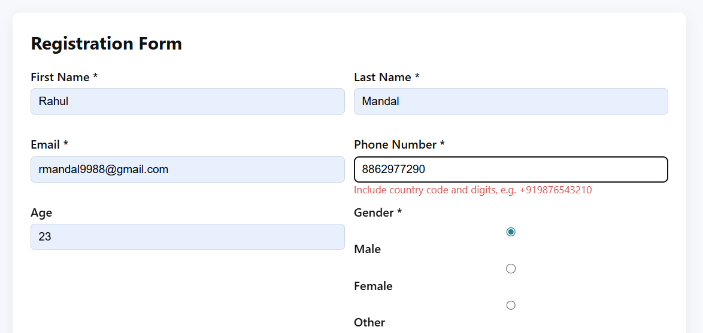
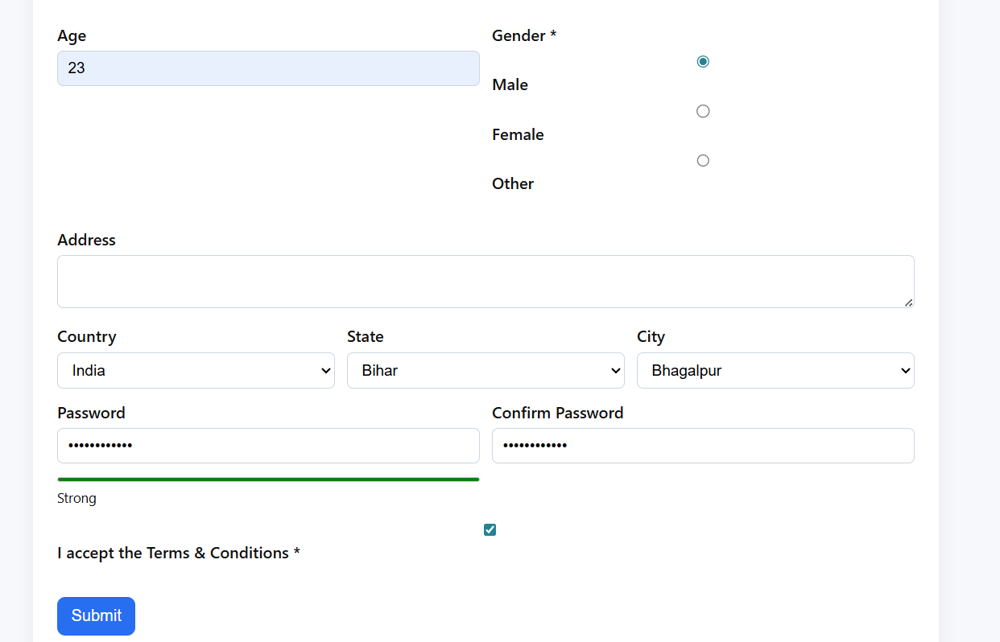
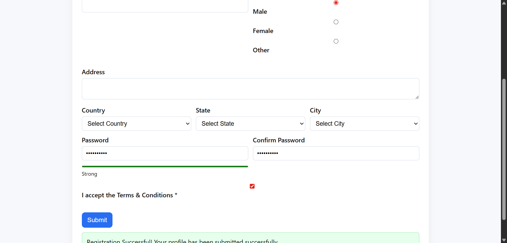

# 🧠 Intelligent Registration System Automation

## 📌 Overview
This project is a **web-based registration form** with strong client-side validations, tested using **Selenium automation**.  
It covers **negative, positive, and logical UI test scenarios**, simulating real-world QA workflows.

---

## 🛠 Tech Stack
- HTML, CSS, JavaScript  
- Selenium WebDriver (Python)  
- Google Chrome  

---

## ✨ Features
- Mandatory field validation  
- Password strength indicator  
- Email validation (disposable emails blocked)  
- Dynamic Country → State → City dropdowns  
- Submit button enabled only when form is valid  

---

## 🤖 Automation Test Coverage
- ❌ Negative test (missing required fields)  
- ✅ Positive test (successful registration)  
- 🔁 Logical validation (UI behavior & dropdown logic)  

---

## 📸 Screenshots

### ❌ Error State (Negative Test)

### 🔁 Logic State (Dropdowns / Password Validation)

### ✅ Success State (Form Submitted)

> 📌 Upload your screenshots inside a `screenshots/` folder and keep the same names.

---

## 🚀 How to Run

### Run Form

---

## 👨‍💻 Author
**Rahul Mandal**  
UPES Dehradun | Automation & QA Enthusiast  

🔗 GitHub: https://github.com/rahul886297/Intelligent-Registration-System-main

